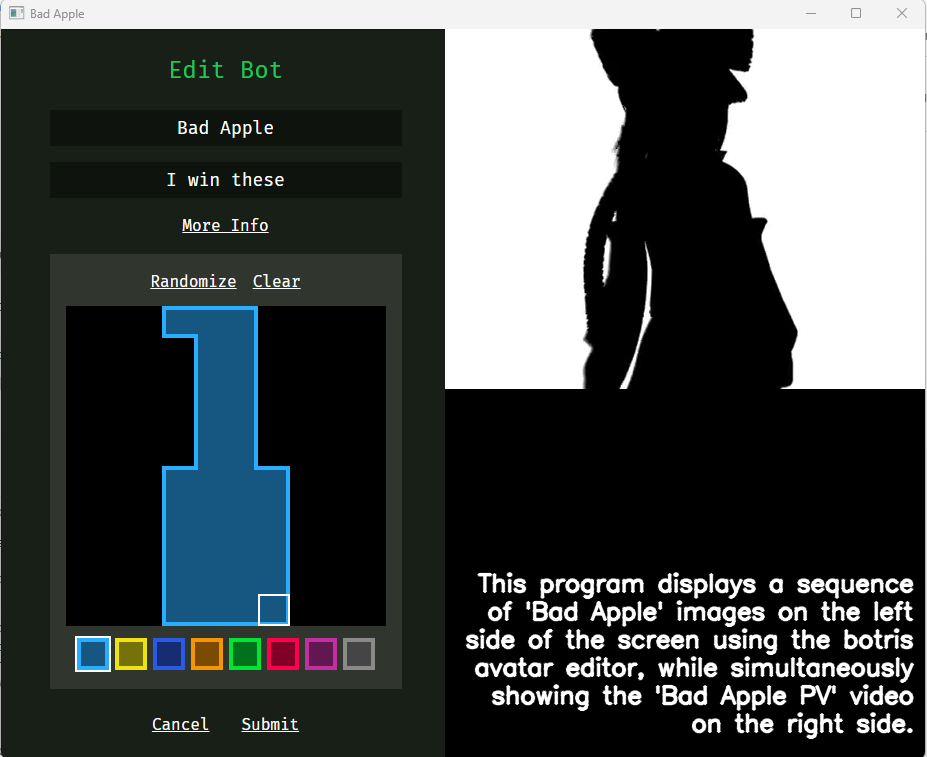

# README

## Project Overview

This project recreates the "Bad Apple" animation using the Botris avatar editor. It involves converting an image sequence into binary matrices, drawing each frame on the editor's grid, and playing the animation alongside the original video.

## Components

1. **Mouse Positioning Script (`find_pixels.py`)**: Identifies pixel coordinates for the Botris avatar editor grid using `pynput` to detect mouse events.

2. **Image to Binary Matrix Conversion (`generate_matrices.py`)**: Converts each frame of the "Bad Apple" sequence into a 10x10 binary matrix using `Pillow` for image processing and `numpy` for numerical operations.

3. **Matrix Drawing Script (`generate_final.py`)**: Automates drawing binary matrices onto the Botris editor with mouse clicks using `pyautogui`.

4. **Playback Script (`play.py`)**: Plays the generated animation in sync with the original "Bad Apple" video, using `cv2` (OpenCV) for video playback and `pygame` for audio playback.

## Process

1. **Find Pixel Placements**: Use `find_pixels.py` to determine grid coordinates in the Botris avatar editor.
2. **Convert Images to Matrices**: Run `generate_matrices.py` to convert the image sequence into binary matrices.
3. **Draw Matrices**: Execute `generate_final.py` to draw each frame onto the Botris editor.
4. **Play Animation**: Finally, use `play.py` to display the created animation alongside the original "Bad Apple" video.

